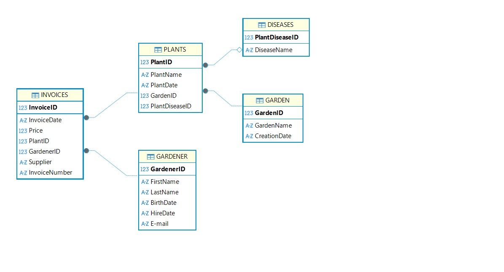

# SQL-project
sample database for SQL -garden management

This project presents a relational database built for managing gardens. I’ve created the database as SQLite. It could be helpful for plants management, employee efficiency and activations necessary to proceed with plants care.

The database consists of the following main tables:
garden (information about gardens, names and creation date),
plants (datails about plants),
gardener (employee data),
invoices (purchase data),
deseases (main diseases of plants).
## ERD 
The database is designed using relational principles. Each table has a primary key for unique identification. Foregin keys are used to define relationships between entities. The use of foregin keys enforces relational integrity between tables. Each pant is assigned to indicated garden. Each invoice is assigned to indicated plant. For each invoice is responsible indicated gardener. Some plants could have some diseases from the diseases table.
I’ve created some views as examples of information that can be obtained.
You can check if there are any plants without diseases.
The next issue is to calculate employess hire lenght.
You cacan find out the number of plants by each gardener.
